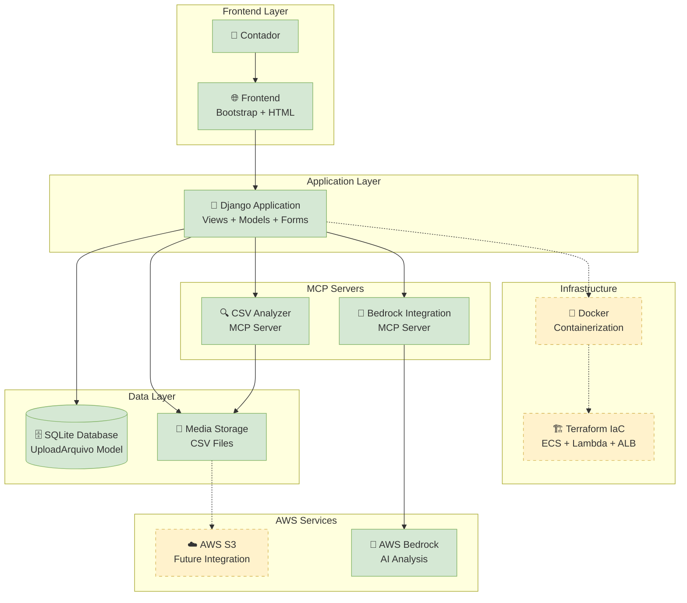
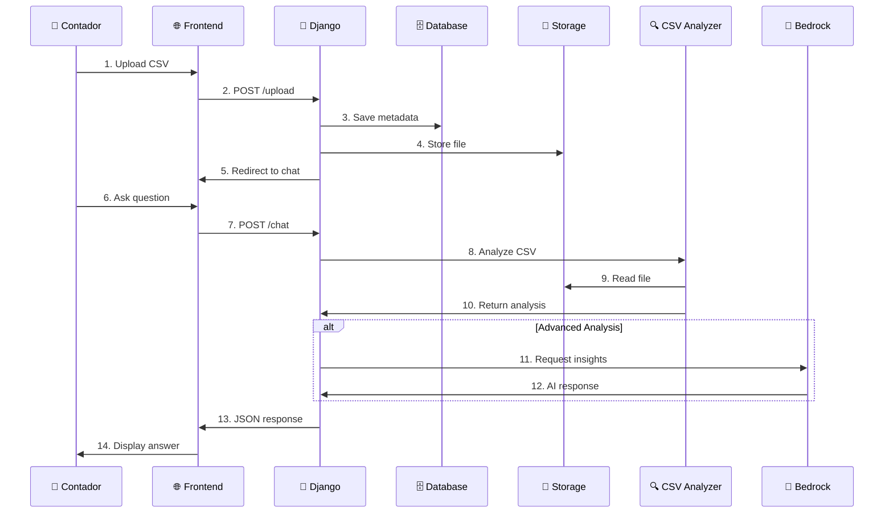

# Diagrama de Arquitetura - ContAI Finance

## Arquitetura Geral

## Fluxo de Dados

## Componentes Principais

### 1. Frontend
- **Bootstrap 5** para UI responsiva
- **HTML5** templates com Django
- **JavaScript** para interações AJAX

### 2. Backend
- **Django 5.2.6** framework web
- **SQLite** banco de dados local
- **Boto3** para integração AWS (futuro)

### 3. MCP Servers
- **CSV Analyzer**: Análise local de arquivos CSV
- **Bedrock Integration**: IA para insights avançados

### 4. Infraestrutura (Planejada)
- **Docker** para containerização
- **Terraform** para IaC na AWS
- **ECS Fargate** para deploy
- **S3** para armazenamento de arquivos
- **Lambda** para processamento serverless

## Tecnologias Utilizadas

| Componente | Tecnologia | Status |
|------------|------------|--------|
| Frontend | Bootstrap 5, HTML5, JS | ✅ Implementado |
| Backend | Django 5.2.6, Python 3.8+ | ✅ Implementado |
| Database | SQLite | ✅ Implementado |
| Storage | Local Media | ✅ Implementado |
| MCP | CSV Analyzer | ✅ Implementado |
| AI | AWS Bedrock | ✅ Implementado |
| Container | Docker | 🔄 Planejado |
| Cloud | AWS S3, ECS, Lambda | 🔄 Planejado |
| IaC | Terraform | 🔄 Planejado |