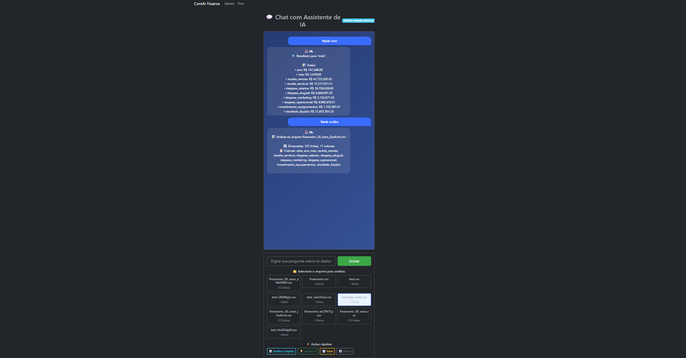
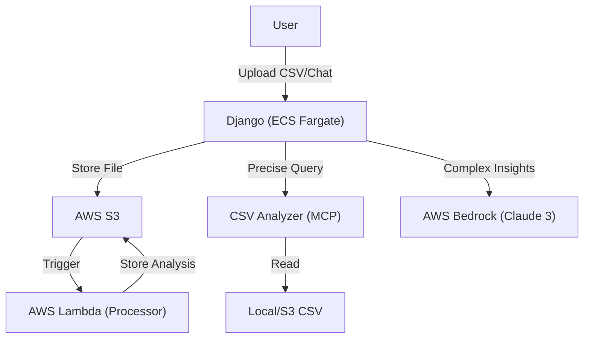

# ContAI Finance

**Project developed for TDC 2025 - Q Developer Quest**

A Django application designed for accountants to upload CSV files and interact with an AI-powered assistant for financial analysis.

## 📊 Project Status

[](https://www.python.org/)
[](https://www.djangoproject.com/)
[](LICENSE)
[](https://github.com/oVitorio-ac/ContAI-Finance/actions)
[](docs/development/testing.md)
[](docs/development/testing.md)

## 🏷️ Tags

- `q-developer-quest-tdc-2025`
- `django`
- `aws`
- `amazon-q-developer`
- `financial-analysis`
- `mcp-server`

## 📸 Screenshots

### Upload Screen


### Chat Interface


## 🚀 Getting Started

### Prerequisites

- Python 3.12 or superior
- Poetry
- Git

### Installation Steps

1. **Clone the repository**:
   ```bash
   git clone https://github.com/oVitorio-ac/ContAI-Finance.git
   cd ContAI-Finance
   ```

2. **Setup with Poetry**:
   ```bash
   # Install dependencies
   poetry install
   
   # Activate virtual environment
   poetry shell
   ```

3. **Database Setup**:
   ```bash
   python manage.py makemigrations
   python manage.py migrate
   ```

4. **Run the Server**:
   ```bash
   python manage.py runserver
   ```

5. **Access the App**:
   - Home/Upload: http://127.0.0.1:8000/
   - Chat: http://127.0.0.1:8000/chat/

## 🛠️ Tech Stack

- **Backend**: Django 5.2.6
- **Frontend**: Bootstrap 5, HTML5
- **Database**: SQLite (Development) / S3 integration for files
- **Cloud Infrastructure**: AWS (S3, ECS, Lambda, Bedrock)
- **Development Tools**: Amazon Q Developer, Terraform, Docker
- **Package Manager**: Poetry

## 📁 Project Structure

```text
ContAI-Finance/
├── src/                          # 📁 Source code
│   ├── contai_finance/          # 🏗️ Django project settings
│   ├── financeiro/              # 📦 Main application module
│   ├── mcp_server/             # 🔧 MCP Services (CSV Analyzer, Bedrock)
│   ├── static/                  # 🎨 Static assets
│   ├── templates/               # 📄 HTML templates
│   └── manage.py                # 🎯 Django entry point
├── tests/                        # 🧪 Test suite
├── infrastructure/               # ☁️ Infrastructure as Code
│   ├── terraform/               # 🏗️ AWS IaC
│   ├── docker/                  # 🐳 Containerization
│   └── scripts/                 # 📜 Deployment & Helper scripts
├── docs/                         # 📚 Comprehensive documentation
├── .env.example                  # 🔐 Environment variables template
└── pyproject.toml                # 📦 Poetry configuration
```

## 🎯 Key Features

- ✅ **CSV File Upload**: Secure handling and storage.
- ✅ **AI Chat Interface**: Interactive financial insights.
- ✅ **MCP Servers**: Specialized tools for precise CSV analysis and Bedrock automation.
- ✅ **AWS Integration**: Bedrock for advanced AI, S3 for storage, and Lambda for triggers.
- ✅ **Automated Testing**: Comprehensive suite with >90% coverage.
- ✅ **IaC Ready**: Full infrastructure definition with Terraform for AWS deployment.

## 📊 Architecture

The project leverages a hybrid architecture combining a Django monolith with serverless AWS components for specialized tasks.



For more details, see our [Architecture Documentation](docs/architecture/technical-documentation.md).

## 🧪 Testing

Run tests using Pytest or the custom runner script:

```bash
# All tests
python run_tests.py

# Using Pytest directly
pytest

# With coverage report
pytest --cov=src --cov-report=html
```

## 🏆 TDC 2025 - Q Developer Quest Progress

- ✅ **Tier 1**: Project generated with Amazon Q Developer, Public Repo, Screenshots, and Prompt List.
- ✅ **Tier 2**: Architecture Diagrams (Mermaid), Automated Tests (19), Technical Documentation.
- ✅ **Tier 3**: Three MCP Servers integrated, AWS Bedrock integration, IaC (Terraform), ECS/Fargate Deployment.

## 🤝 Contributing

Contributions are welcome! Please check our [Contributing Guidelines](https://github.com/oVitorio-ac/.github/blob/main/CONTRIBUTING.md) and [Development Guide](docs/development/development.md) for more information.

## 📄 License

This project is licensed under the MIT License - see the [LICENSE](LICENSE) file for details.
