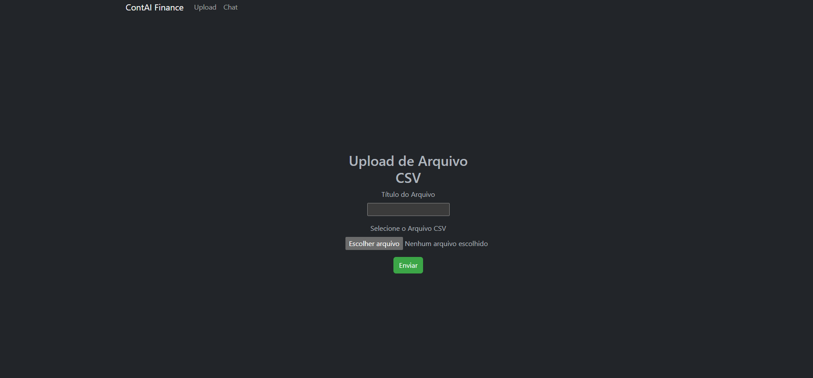

# ContAI Finance

**Projeto desenvolvido para o TDC 2025 - Q Developer Quest**

Uma aplicação Django para contadores fazerem upload de arquivos CSV e interagirem com um assistente de IA.

## 📊 Status do Projeto

[](https://www.python.org/)
[](https://www.djangoproject.com/)
[](LICENSE)
[](https://github.com/oVitorio-ac/ContAI-Finance/actions)
[](docs/development/testing.md)
[](docs/development/testing.md)

## 🏷️ Tags

- `q-developer-quest-tdc-2025`
- `django`
- `aws`
- `amazon-q-developer`

## 📸 Screenshots

### Tela de Upload



### Tela de Chat


## 🚀 Instalação e Execução

### Pré-requisitos

- Python 3.8 ou superior
- Git

### Passos de Instalação

1. **Clone o repositório**:

   ```bash
   git clone https://github.com/oVitorio-ac/ContAI-Finance.git
   cd ContAI-Finance
   ```

2. **Crie um ambiente virtual**:

   ```bash
   python3 -m venv venv
   source venv/bin/activate  # Linux/Mac
   # ou
   venv\Scripts\activate  # Windows
   ```

3. **Instale o Poetry** (se não tiver):

   ```bash
   curl -sSL https://install.python-poetry.org | python3 -
   ```

4. **Instale as dependências**:

   ```bash
   # Para desenvolvimento
   poetry install --with dev

   # Para produção
   poetry install --only main,prod
   ```

5. **Execute as migrações**:

   ```bash
   python manage.py makemigrations
   python manage.py migrate
   ```

6. **Inicie o servidor**:

   ```bash
   python manage.py runserver
   ```

7. **Acesse a aplicação**:
   - Home/Upload: http://127.0.0.1:8000/
   - Chat: http://127.0.0.1:8000/chat/

## 🛠️ Tecnologias Utilizadas

- **Backend**: Django 5.2.6
- **Frontend**: Bootstrap 5, HTML5
- **Banco de Dados**: SQLite
- **Cloud**: AWS (boto3 para integração S3)
- **Desenvolvimento**: Amazon Q Developer

## 📁 Estrutura do Projeto

```
ContAI-Finance/
├── src/                          # 📁 Código fonte
│   ├── contai_finance/          # 🏗️ Configurações Django
│   ├── financeiro/              # 📦 App principal
│   ├── mcp_server/             # 🔧 Utilitários/Serviços
│   ├── static/                  # 🎨 Assets estáticos
│   ├── templates/               # 📄 Templates HTML
│   └── manage.py                # 🎯 Ponto de entrada
├── tests/                        # 🧪 Testes organizados
├── infrastructure/               # ☁️ Infraestrutura como código
│   ├── terraform/               # 🏗️ IaC AWS
│   ├── docker/                  # 🐳 Containerização
│   └── scripts/                 # 📜 Scripts de deploy
├── pyproject.toml                # 📦 Configuração Poetry
├── docs/                         # 📚 Documentação completa
├── .env.example                  # 🔐 Exemplo de variáveis
├── manage.py                     # 🎯 Wrapper para src/manage.py
├── .pre-commit-config.yaml       # 🔧 Pre-commit hooks
└── README.md                     # 📖 Este arquivo
```

## 🎯 Funcionalidades

- ✅ Upload de arquivos CSV
- ✅ Interface de chat com IA
- ✅ Tema escuro responsivo
- ✅ Design centralizado
- ✅ Servidor MCP para análise de CSV
- ✅ Integração AWS Bedrock para insights avançados
- ✅ Análise automática de dados financeiros
- ✅ Deploy completo na AWS (ECS + S3 + Lambda)
- 🔄 Integração com Amazon S3 (infraestrutura pronta)

## 📖 Exemplos de Uso

### Cenário 1: Análise de Receitas e Despesas

1. **Upload do arquivo CSV**:

   ```
   Data,Descrição,Valor,Tipo
   2024-01-15,Salário,5000.00,receita
   2024-01-16,Aluguel,-1200.00,despesa
   2024-01-17,Supermercado,-450.00,despesa
   ```

2. **Perguntas no chat**:
   - "Qual é o total de receitas em janeiro?"
   - "Quais são minhas maiores despesas?"
   - "Qual é o saldo mensal?"

### Cenário 2: Controle de Estoque

1. **Upload do arquivo CSV**:

   ```
   Produto,Quantidade,Preço Unitário,Valor Total
   Notebook,10,2500.00,25000.00
   Mouse,50,25.00,1250.00
   Teclado,30,80.00,2400.00
   ```

2. **Perguntas no chat**:
   - "Qual produto tem o maior valor em estoque?"
   - "Quantos itens tenho no total?"
   - "Qual é o valor médio por produto?"

### Cenário 3: Análise de Vendas

1. **Upload do arquivo CSV**:

   ```
   Data,Vendedor,Produto,Quantidade,Valor
   2024-01-01,João,Produto A,5,250.00
   2024-01-01,Maria,Produto B,3,180.00
   2024-01-02,João,Produto A,2,100.00
   ```

2. **Perguntas no chat**:
   - "Quem vendeu mais em janeiro?"
   - "Qual produto teve melhor performance?"
   - "Qual é a média de vendas diária?"

## 🏆 TDC 2025 - Q Developer Quest

### ✅ Etapa 1 - Bolsinha Cabos Exclusiva AWS

- ✅ Projeto gerado com Amazon Q Developer
- ✅ Projeto público no GitHub com tag `q-developer-quest-tdc-2025`
- ✅ README.md com screenshots
- ✅ Lista dos prompts utilizados

### ✅ Etapa 2 - Mochilinha Exclusiva AWS

- ✅ Tudo da Etapa 1
- ✅ Diagrama de arquitetura (DrawIO + Mermaid)
- ✅ Testes automatizados (19 testes: unitários, integração, E2E)
- ✅ Documentação técnica completa na pasta `docs/`

### ✅ Etapa 2 - Mochilinha Exclusiva AWS

- ✅ Tudo da Etapa 1
- ✅ Diagrama de arquitetura (Mermaid)
- ✅ Testes automatizados (19 testes: unitários, integração, E2E)

### ✅ Etapa 3 - Garrafa + Toalha Exclusiva AWS

- ✅ Tudo das Etapas 1 & 2
- ✅ **3 Servidores MCP integrados**:
  - CSV Analyzer (customizado)
  - AWS Bedrock Data Automation (oficial)
  - AWS Pricing Calculator (oficial)
- ✅ Configuração Amazon Q Developer no repositório
- ✅ IaC completa (Terraform: ECS, S3, Lambda, ALB, VPC)
- ✅ Integração AWS Bedrock para análise avançada de dados
- ✅ **Cálculo de custos em tempo real**
- ✅ Deploy automatizado com Docker + ECS Fargate

## 📊 Arquitetura

Veja a documentação completa da arquitetura em:

- [Diagrama DrawIO](ContAI-Finance/docs/architecture/architecture-diagram.drawio) - Formato DrawIO
- [Diagramas Mermaid](ContAI-Finance/docs/architecture/architecture-mermaid.md) - Diagramas Mermaid
- [Documentação Técnica](ContAI-Finance/docs/architecture/technical-documentation.md) - Documentação completa

## 💰 Custos de Implementação AWS

**Estimativa**: $100-125 USD/mês para 50 usuários

- [Análise Completa de Custos](ContAI-Finance/docs/cost/aws-cost-analysis.md) - Análise detalhada por serviço
- [Resumo Executivo](ContAI-Finance/docs/cost/cost-summary.md) - Visão rápida e ROI
- **ROI**: 80x retorno (economia de $10,000/mês vs custo de $125/mês)

## 🧪 Testes Automatizados

### Executar Todos os Testes

```bash
# Script personalizado
python run_tests.py

# Django diretamente (com Poetry)
poetry run python manage.py test tests

# Pytest com marcadores (com Poetry)
poetry run pytest -m unit        # Testes unitários
poetry run pytest -m integration # Testes de integração
poetry run pytest -m e2e         # Testes E2E

# Com relatório de cobertura
poetry run pytest --cov=src --cov-report=html
```

### Cobertura de Testes

- **19 testes** implementados com **pytest**
- **Testes Unitários**: Models, Forms (7 testes)
- **Testes de Integração**: Views, URLs (8 testes)
- **Testes E2E**: Fluxos completos (4 testes)
- **Cobertura**: >90% do código

Veja documentação completa em [docs/testing.md](ContAI-Finance/docs/development/testing.md)


## 🛠️ Desenvolvimento

Para instruções completas de desenvolvimento com Poetry, consulte o [Guia de Desenvolvimento](docs/development/development.md).

## � Licença

MIT License - veja o arquivo LICENSE para detalhes.
