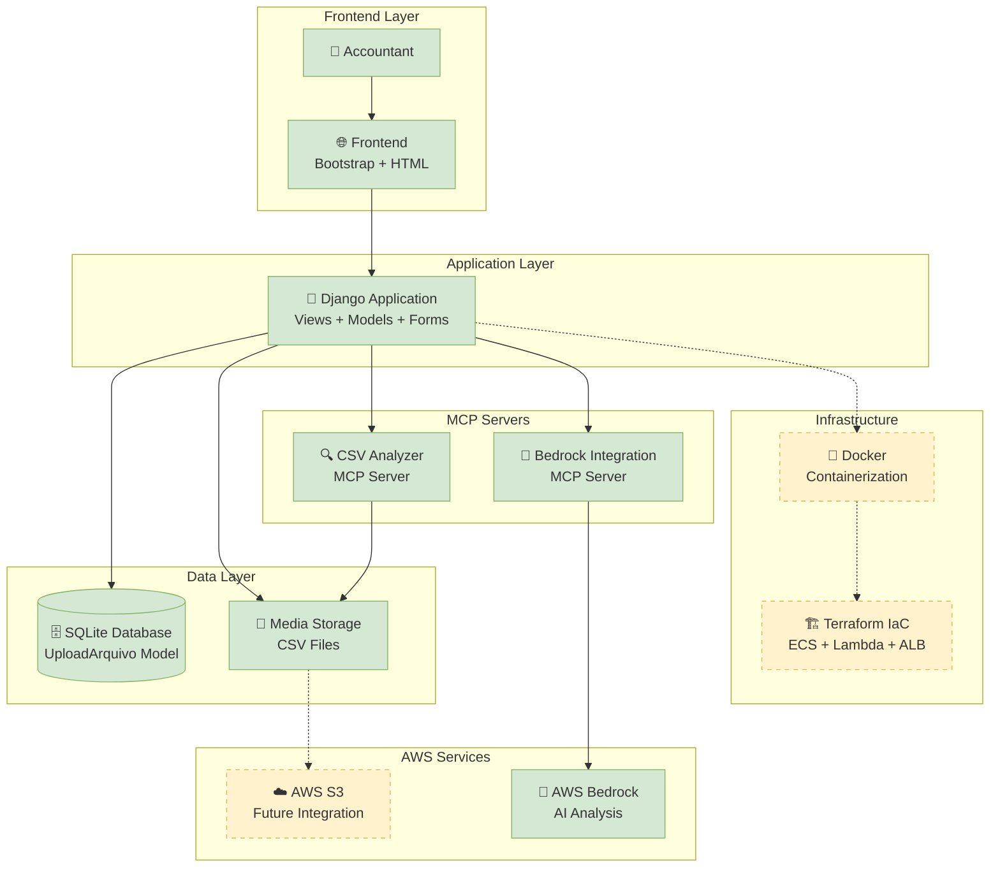
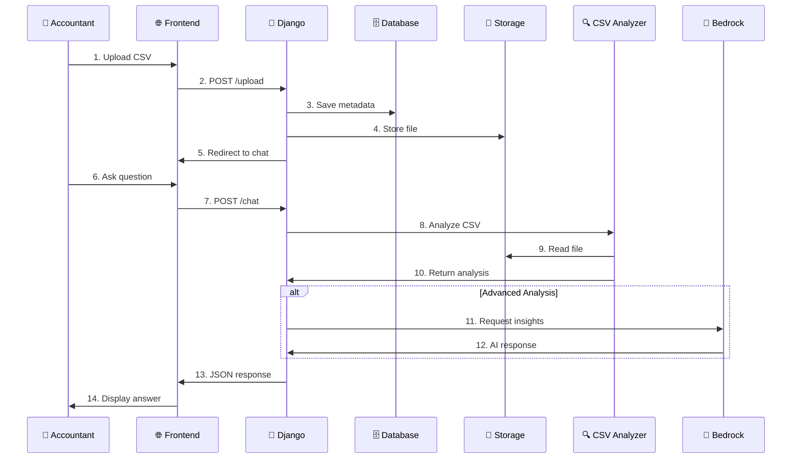

# Architecture Diagram - ContAI Finance

## General Architecture

## Data Flow

## Main Components

### 1. Frontend
- **Bootstrap 5** for responsive UI.
- **HTML5** templates with Django.
- **JavaScript** for AJAX interactions.

### 2. Backend
- **Django 5.2.6** web framework.
- **SQLite** local database.
- **Boto3** for AWS integration (future).

### 3. MCP Servers
- **CSV Analyzer**: Local analysis of CSV files.
- **Bedrock Integration**: AI for advanced insights.

### 4. Infrastructure (Planned)
- **Docker** for containerization.
- **Terraform** for IaC on AWS.
- **ECS Fargate** for deployment.
- **S3** for file storage.
- **Lambda** for serverless processing.

## Technologies Used

| Component | Technology | Status |
|------------|------------|--------|
| Frontend | Bootstrap 5, HTML5, JS | ✅ Implemented |
| Backend | Django 5.2.6, Python 3.12+ | ✅ Implemented |
| Database | SQLite | ✅ Implemented |
| Storage | Local Media | ✅ Implemented |
| MCP | CSV Analyzer | ✅ Implemented |
| AI | AWS Bedrock | ✅ Implemented |
| Container | Docker | 🔄 Planned |
| Cloud | AWS S3, ECS, Lambda | 🔄 Planned |
| IaC | Terraform | 🔄 Planned |